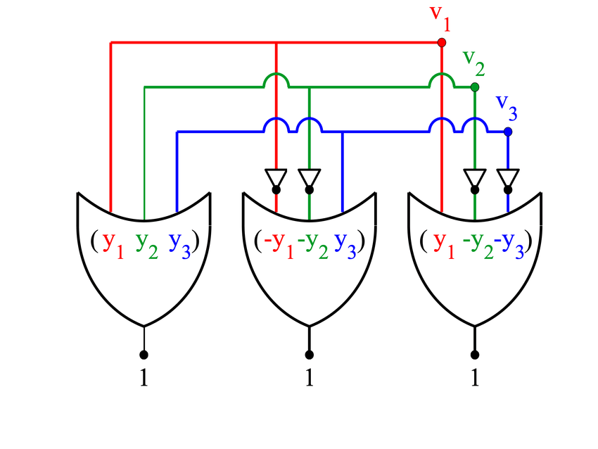
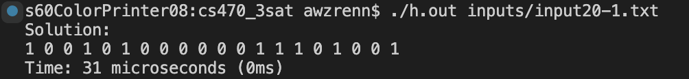
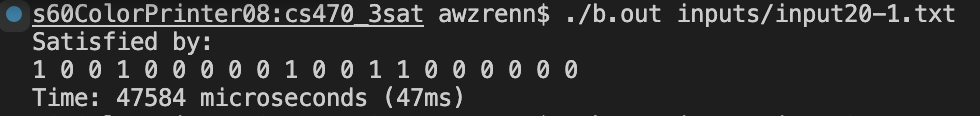
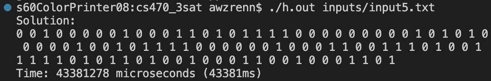
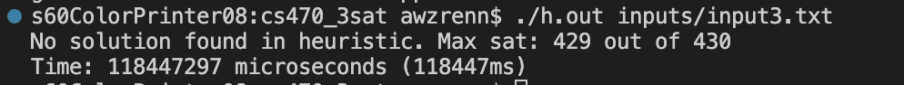
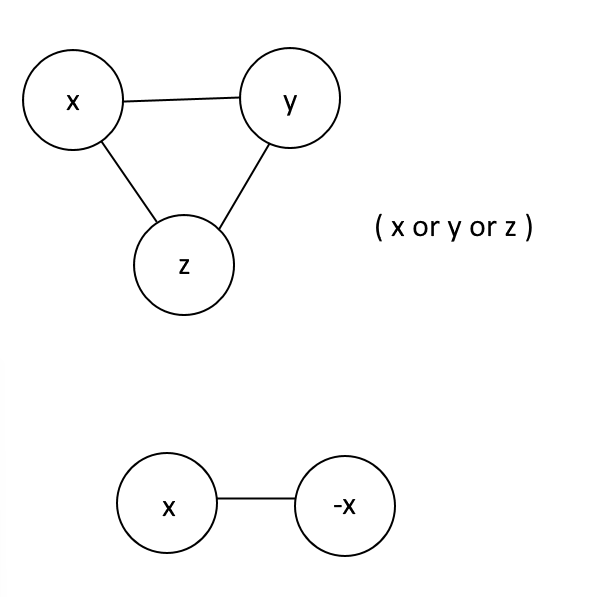
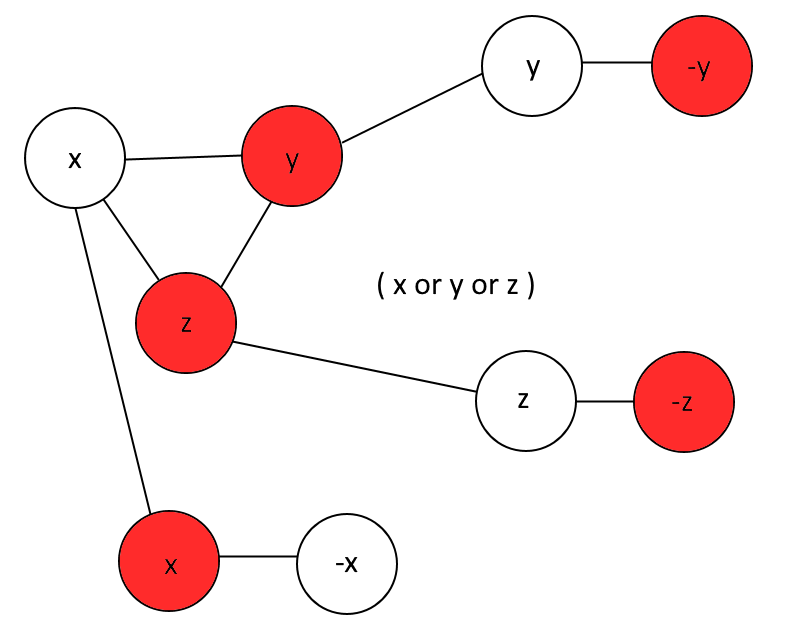
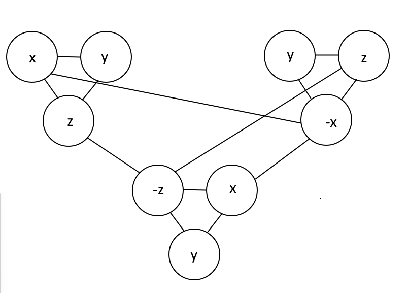
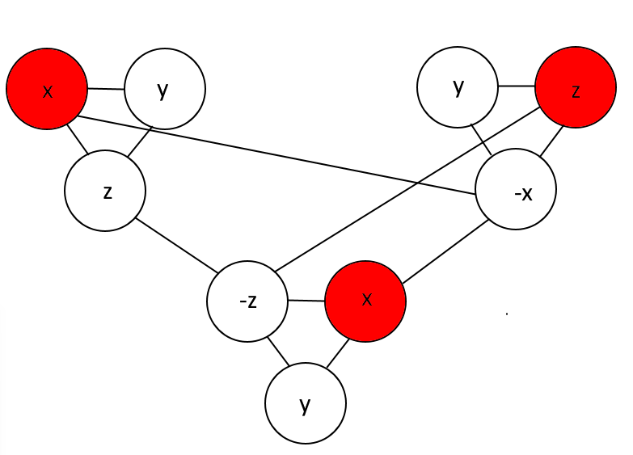

# CS 570 NP-Complete project: 3SAT
University of Alabama, SPR 23   Professor: Dr. Yessick
 
Submission: **Andrew Renninger**

## **Contents**
This project contains a brute force solver for 3-Satisfiability CNF (3SAT), a heuristic solver, and multiple data files to test these solvers out. 

3-SAT CNF is a problem where you are given a set of clauses in [Conjunctive Normal Form](https://en.wikipedia.org/wiki/Conjunctive_normal_form), and are asked if there is an input to satisfy the formula. It is proven to be NP-Complete, and is also often used to prove that other problems are NP-Hard. 
ex. The 3-Sat problem:

**(y1 | y2 | y3) &(!y1 | !y2 | y3) & (y1 | !y2 | !y3)**

can be represented as:

 [[1]](#1)

and is solvable by:     
y1= 1/true   
y2= 0/false  
y3= 0/false  

  

### Files
- [brute.cpp](brute.cpp) this is the code for the brute force 3SAT algorithm.
- [heuristic.cpp](heuristic.cpp) this is the code for the heuristic 3SAT algorithm.
- [mappings.ipynb](mappings.ipynb) this is the code for the mappings - 3SAT to vertex cover and 3SAT to independent set
- The [test cases/input files](#t) are described below and in the files themselves

## Getting started
### **Installation**
- In order to run the 3-Sat solvers, g++ and make are needed. On Windows, this can be done through [WSL](https://okunhardt.github.io/documents/Installing_WSL.pdf), or Cygwin. 
- On MacOS, g++ is symlinked to clang by default. If you install g++ through [homebrew](https://docs.brew.sh/Installation) (brew install gcc), you will have to relink that.
- On Ubuntu/debian based linux, run "sudo apt install build-essential".
- In order to run the mappings, [Python3](https://www.python.org/downloads/), as well as a python notebook kernel ([kernel only](https://ipython.readthedocs.io/en/stable/install/kernel_install.html) or [jupyter notebook](https://jupyter.org/install) or [vscode](https://code.visualstudio.com/docs/datascience/jupyter-notebooks)) must be installed. I recommend jupyter notebook for first time users.

### **Compiling and Running**
  This project comes with a makefile. In order to compile, simply run 'make'. The heuristic can be ran as "./h.out 3SAT_INPUT.dat" and the brute force as "./b.out 3SAT_INPUT.dat"

To run the mapping scripts, python is needed, as well as a method to run the notebook files (.ipynb). This can be done through jupyter notebook, but Visual Studio Code also has an integration, just the jupyter kernel is needed. [More instructions on how to use jupyter can be found here.](https://www.dataquest.io/blog/jupyter-notebook-tutorial/)

## **Algorithms**
### Brute force
In the brute force algorithm, every possible set of inputs to the formula is tested to see if it satisfies the formula. Because each variable is boolean, there are 2n possible inputs, tested on up to **m** possible clauses (test until one fails), the base time complexity of this algorithm. This will process the entire input space, and as such can definitively give an answer that the problem has or hasn't a solution. 

 

### Heuristic
The heuristic algorithm starts similar to the brute force algorithm, by testing the clauses with a set of the input variables. However, the initial state of the variables is randomized. When a clause is tested to be false, one of the variables of the clause is chosen at random, each with a 1/3 chance to be flipped/toggled. If all of the clauses are tested without failing, then the algorithm has found an answer. This is done for a set polynomial amount of iterations, currently set for n3*m (number of clauses), tested on the clauses until one fails, by which point the algorithm says it is unsolvable.  
  The performance gains of this algorithm can be seen as the inputs get larger
When ran on larger datasets, ex. 20 variables, 91 clauses, the heuristic can get the solution for a problem in as little as 31 microseconds. 
The brute force algorithm does it in ~47000 microseconds, or roughly 940x slower. 

For even larger dataset, 100 variables and 430 clauses, for example, a size that I cannot get the brute force to finish at (it could be optimized to run on all cores), the heuristic can be able to get a solution. 

A key weakness to this algorithm is determining when it should give up and say that the problem has no solution. Different problems with the same about of variables and clauses can have vastly different average solution times. If the algorithm gives up too early, it will miss the solution, but if it gives up too late, it is just wasting time. This is an example of the heuristic giving up, taking 118.4 seconds. 

### Testing

Our format can be see in [3sat_ex.dat](3sat_ex.dat). The first line contains the number of variables, then the lines after contain the clauses until the first character is $.

To test both of these algorithms, I made [cnf_to_txt.ipynb](cnf_to_txt.ipynb) to convert existing 3SAT benchmark files found at [https://www.cs.ubc.ca/~hoos/SATLIB/benchm.html](https://www.cs.ubc.ca/~hoos/SATLIB/benchm.html) from DIMACS cnf format to our format. I also made [sol_check.ipynb](sol_check.ipynb) to test the solutions each algorithm gave.

### <a id="t">Test cases</a> 
Creating test cases, I found that test cases where one variable is repeated twice in the same clause could make the heuristic have to work longer and therefore fail more often. This can be seen with 
- [3sat_awrenninger.txt](3sat_awrenninger.txt), where the heuristic running with n3 iterations failed 67% of the time, but solving it 268x faster when it did. A more in-depth explanation can be found at the bottom of the test case. 20 variables, 70 clauses.
- [3sat_awrenninger_small.txt](3sat_awrenninger_small.txt) is a problem that takes a longer time on the heuristic to solve than normal. 4 variables, 7 clauses.
- [inputs/input3.txt](inputs/input3.txt) is a problem that has no solution so far, but has a maximum found satisfiability of 429 out of 430 clauses. 100 variables, 430 clauses
- [inputs/input5.txt](inputs/input5.txt) is a problem that the heuristic is able to solve in a reasonable time, that the brute force cannot. 100 variables, 430 clauses.

### Limitations/deficiency
The main limitation of the brute force algorithm is the scaling amount of time it takes to run/complete. At 2n, every variable added doubles the worst case running time. 
A weakness of the heuristic algorithm is determining when to stop as described above. Another weakness is getting stuck in local extrema, where the same variable keeps getting changed due to the order of the clauses, which is mitigated by starting with a randomized initial state, iterating more. 

## Mappings
The code for the mappings can be found at [mappings.ipynb](mappings.ipynb)

The first block sets the input and output files, the second block reads the input file in.
The third block determines if the edge is repeated twice in the output files - some people didn't follow the format given in the format guide for the directed/undirected graph, so this can make up for that. 

### **3SAT to Vertex Cover**

The fourth block transforms the input file, a 3SAT input file to K-vertex cover. K-vertex cover asks if k vertices can be chosen such that they touch every edge. 

[3sat_awrenninger_small.txt](3sat_awrenninger_small.txt) mapped to vertex cover can be found at [vertexcover_awrenninger.txt](vertexcover_awrenninger.txt) 

A k-covering for this corresponding graph corresponds to a correct input for the 3SAT problem, and vice versa. K = n (number of variables) + 2 * m (number of clauses). Each variable and clause get their own "gadgets", which correspond to the variables. The clause vertices are linked to their corresponding variable vertex.

These are the gadgets:

If a solution exists where "x" is true, then that vertex is selected. Therefore, the edge to the corresponding variable is covered. Then, the two other variables in the gadget are selected -> this is why k is equal to n + 2*m -> a correct solution will have at least one k-cover. Multiple solutions can have multiple different k-covers.

k = 3 + 2*1 = 5
There are multiple 5-covers for this graph. This is one example.

This example corresponds to x=1 y=0 z=0

### **3SAT to Independent Set**

The fifth block transforms the input 3SAT file to an independent set problem. The k-independent set problem asks if you can select k vertices and have none of them share an edge with each other.
The mapping given on wikipedia and in most pictures is to the clique problem, and so I chose independent set, because while similar to clique, it is an interesting problem.
The mapping to independent set also uses gadgets, the same gadget for clauses. However, the edges that are connected are from the clauses to each other. Each vertex is connected to their complementary labels, if they exist.

[3sat_awrenninger_small.txt](3sat_awrenninger_small.txt) mapped to independent set can be found at [independentset_awrenninger.txt](independentset_awrenninger.txt) 

(X or Y or Z) and (X or Y or -Z) and (-X or Y or Z) corresponds to

Therefore, if a solution exists to the 3SAT problem, a k-independent set exists for this mapping. Because each clause has each variable connected to each other, for a k-independent set to exist, one vertex from each clause must be true - the 3SAT problem. Because each variable is connected to its complements, the k-independent set cannot contain a variable and its complement (cannot have x and -x). Therefore, when a k-independent set exists, so must a 3SAT solution.

The solution x=1 y=1 z=1 can correspond to: 

Multiple different k-independent sets can correspond to the same answer. In this example, the "Z" in the top left clause could have been selected instead of the x, and this would still be a valid k-independent set.

## References
<a id="1">[1]</a> 
Bearden, Sean & Sheldon, Forrest & Di Ventra, Massimiliano. (2019). Critical branching processes in memcomputing. 